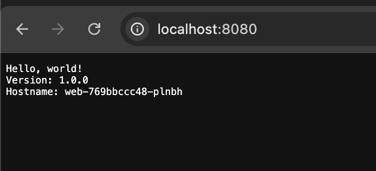

# Deploy Applications with Kind

[Kind](https://kind.sigs.k8s.io/)  is a tool for running local Kubernetes clusters using Docker container nodes. Kubernetes is a popular orchestration platform that is used by many organizations to deploy applications. Kind consists of the following:

- Go packages implementing cluster creation, image build, etc.
- A command line interface (kind) built on these packages.
- Docker image(s) written to run systemd, Kubernetes, etc.
- kubetest integration also built on these packages (WIP).

This tutorial teaches you how to deploy an application with kind using a container image from Google Container Registry (GCR). You will learn how to create a cluster, add a YAML configuration file, and use port forwarding to access your application in your browser.

## Prerequisites

To complete this tutorial, you will need to install the following.

- [Docker](https://www.docker.com/products/docker-desktop/) 
- [kind](https://kind.sigs.k8s.io/docs/user/quick-start/#installation)
- [kubectl](https://kubernetes.io/docs/tasks/tools/) 
- [Visual Studio Code](https://code.visualstudio.com/download)  or command line interface. 

### Create a cluster

Start kind with the command `kind create cluster` and wait for the setup to complete.

```
$ Creating cluster "kind" ...
 ✓ Ensuring node image (kindest/node:v1.34.0) 🖼
 ✓ Preparing nodes 📦
 ✓ Writing configuration 📜
 ✓ Starting control-plane 🕹️
 ✓ Installing CNI 🔌
 ✓ Installing StorageClass 💾
Set kubectl context to "kind-kind"
You can now use your cluster with:

kubectl cluster-info --context kind-kind

Not sure what to do next? 😅  Check out https://kind.sigs.k8s.io/docs/user/quick-start/
```

## Validate

Verify the connectivity with the Kubernete cluster and the Kubernetes API by using the Command Line Interface(CLI).

`` $ kubectl cluster-info --context kind-kind``

The output displays the control plane IP addresses:

```
Kubernetes control plane is running at https://127.0.0.1:62424
CoreDNS is running at https://127.0.0.1:62424/api/v1/namespaces/kube-system/services/kube-dns:dns/proxy

To further debug and diagnose cluster problems, use 'kubectl cluster-info dump'.
```

## Prepare .yaml File

Create a file named **app.yaml** and insert the following configuration. 

```yml
apiVersion: apps/v1
kind: Deployment
metadata:
  creationTimestamp: null
  labels:
    app: web
  name: web
spec:
  replicas: 1
  selector:
    matchLabels:
      app: web
  strategy: {}
  template:
    metadata:
      creationTimestamp: null
      labels:
        app: web
    spec:
      containers:
      - image: gcr.io/google-samples/hello-app:1.0
        name: hello-app
        resources: {}
status: {}
---
apiVersion: v1
kind: Service
metadata:
  creationTimestamp: null
  labels:
    app: web
  name: web
spec:
  ports:
  - port: 8080
    protocol: TCP
    targetPort: 8080
  selector:
    app: web
  type: NodePort
status:
  loadBalancer: {}
```

The configuration file contains a *deployment* and a *service*. We use the deployment to inform Kubernetes the desired state we want for the application. The application, *web*, also has a service definition that exposes the port of the local cluster node to its external Azure network. The exposed *nodePort* is how you will access the application.

## Deploy Application 

Issue the `kubectl` command to deploy the application:

```shell
$ kubectl apply -f app.yaml
```
The output displays the deployment and service created:

```
deployment.apps/web configured
service/web configured
```
## Expose the Application

Now that the application, web, is deployed you can access the application by exposing the nodePort through port forwarding. You'll need the container name.

To get the container name, issue the following command:

```shell
$ PODNAME=$(kubectl get pods --template '{{range .items}}{{.metadata.name}}{{end}}' --selector=app=web)
```
Now that you have the container name, start the port forwarding with the container to expose the port to the local network.

Issue the `kubectl` command to access the service:

```shell
$ kubectl port-forward $PODNAME 8080:8080
Forwarding from 127.0.0.1:8080 -> 8080
Forwarding from [::1]:8080 -> 8080
```

Visit `localhost:8080` you will see the Hello World welcome page.



## Next Steps

As mentioned before Kubernetes is an orchestration platform used to deploy containerized applications. We hope you now better understand how one can deploy applications to Kubernetes.


